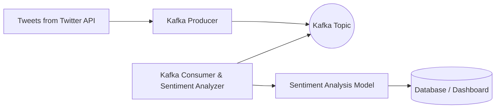

# Twitter-Sentiment-Analysis-using-Kafka-Streaming-
Project for Graduation

   

---

## 🔍 Project Overview

This project performs **real-time Twitter sentiment analysis** using **Apache Kafka** as the streaming backbone. It ingests live tweets, processes the data on-the-fly, and classifies the sentiment as **positive**, **neutral**, or **negative**.

The goal is to build a scalable, fault-tolerant, and efficient pipeline for analyzing public sentiment trends on Twitter in real-time.

---

## ⚙️ Architecture & Workflow

---

Twitter API: Streams live tweets based on chosen keywords or hashtags.

Kafka Producer: Publishes tweet messages to Kafka topics.

Kafka Topic: Acts as a high-throughput message queue.

Kafka Consumer: Reads tweets in real-time and passes them to the sentiment analyzer.

Sentiment Analysis Model: Uses NLP to classify tweets.

Output: Stores results in a database or visualizes on dashboards.

---

## 💡 Key Features
Real-Time Streaming using Apache Kafka.

Live Tweet Ingestion from Twitter API with keyword filtering.

Sentiment Classification: Positive, Neutral, Negative.

Scalable & Fault-Tolerant: Kafka ensures smooth handling of large tweet volumes.

Modular Design for easy integration with visualization tools like Tableau or Power BI.

---

## 🛠️ Technologies Used
| Technology        | Purpose                   |
| ----------------- | ------------------------- |
| Python            | Core development language |
| Apache Kafka      | Streaming platform        |
| Tweepy            | Twitter API integration   |
| TextBlob / VADER  | Sentiment analysis        |
| Docker (optional) | Containerization          |

---

## 🚀 Getting Started
Prerequisites
- Python 3.7+
- Apache Kafka & Zookeeper installed and running
- Twitter Developer Account & API keys

Installation

**1. Clone the repository**

```bash
git clone https://github.com/yourusername/twitter-sentiment-kafka.git
cd twitter-sentiment-kafka
```
**2. Install dependencies**

```bash
pip install -r requirements.txt
```
**3. Configure Twitter API keys**

Create a .env file in the project root and add your Twitter credentials:
```bash
TWITTER_API_KEY=your_api_key
TWITTER_API_SECRET=your_api_secret
TWITTER_ACCESS_TOKEN=your_access_token
TWITTER_ACCESS_SECRET=your_access_secret
```
**4. Start Kafka & Zookeeper**
```bash
# Start Zookeeper
zookeeper-server-start.sh config/zookeeper.properties

# Start Kafka server
kafka-server-start.sh config/server.properties
```
**5. Run Producer & Consumer**
```bash
python kafka_producer.py
python kafka_consumer.py
```
**📈 Sample Output**
```json
{
  "tweet_id": "1234567890",
  "user": "elonmusk",
  "text": "Loving the future of space exploration! 🚀",
  "sentiment": "positive",
  "timestamp": "2025-07-18T20:00:00Z"
}
```
---

## 🤝 Contribution
- Contributions are welcome! Feel free to open issues or submit pull requests for:

- Adding more sentiment models

- Integrating with dashboard tools

- Enhancing Kafka streaming performance

---

## 📚 References & Resources
Apache Kafka Documentation

Twitter Developer Platform

TextBlob Sentiment Analysis

VADER Sentiment Analysis

---

## 📝 License
This project is licensed under the MIT License - see the LICENSE file for details.

---

## 🙏 Acknowledgments
Special thanks to the open-source community for the amazing tools and libraries that made this project possible.
